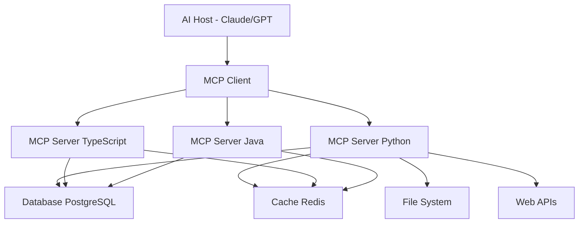

# MCP Tools Boilerplate

A comprehensive, production-ready boilerplate for building Model Context Protocol (MCP) tools with complete implementations in Python, TypeScript, and Java.

## Overview

This boilerplate provides:
- **🐍 Python MCP Server** - Full async implementation with 5 tools and 3 resources
- **📘 TypeScript MCP Server** - Type-safe modern Node.js implementation with Zod validation
- **☕ Java MCP Server** - Enterprise Spring Boot implementation with REST endpoints
- **🔒 Security Templates** - JWT authentication, rate limiting, and input validation
- **🧪 Comprehensive Testing** - Unit, integration, and security tests for all languages
- **🐳 Docker Support** - Multi-container deployment with PostgreSQL, Redis, and Nginx
- **🚀 CI/CD Pipeline** - GitHub Actions with automated testing and builds
- **📚 Extensive Documentation** - Usage examples, security guides, and API documentation

## Architecture



## Quick Start

### Prerequisites
- **Python 3.8+** or **Node.js 18+** or **Java 17+**
- **Docker & Docker Compose** (recommended)

### Option 1: Docker (Recommended)
```bash
# Clone and start all services
git clone <repository>
cd MCP_boilerplate
cp env.example .env
docker-compose up -d

# Test all servers
./scripts/test-servers.sh
```

### Option 2: Manual Setup

#### Python Server
```bash
cd python-server
pip install -r requirements.txt
python server.py
```

#### TypeScript Server
```bash
cd typescript-server
npm install
npm run build
npm start
```

#### Java Server
```bash
cd java-server
./mvnw spring-boot:run
```

## 🛠️ Built-in Tools

### 1. Calculator Tool
- **Purpose**: Perform arithmetic operations (add, subtract, multiply, divide)
- **Input**: Two numbers and operation type
- **Output**: Calculation result with error handling
- **Security**: Input validation, division by zero protection

### 2. File Operations Tool
- **Purpose**: Safe file system access
- **Input**: File paths, operations (read, write, list, delete), optional content
- **Output**: File content or operation status
- **Security**: Directory allowlisting, file size limits, path traversal protection

### 3. Database Query Tool
- **Purpose**: Execute SQL queries on demo database
- **Input**: SQL query string and parameters
- **Output**: Query results in structured format
- **Security**: Read-only queries, parameterized statements, injection protection

### 4. Web Scraper Tool
- **Purpose**: Extract content from web pages
- **Input**: URL, optional CSS selector, max content length
- **Output**: Extracted text or HTML content
- **Security**: Domain allowlisting, content length limits, timeout protection

### 5. Authentication Token Generator
- **Purpose**: Generate JWT tokens for testing
- **Input**: Username
- **Output**: Signed JWT token
- **Security**: Configurable secret, expiration time

## 📊 Available Resources

### 1. Server Configuration
- **URI**: `resource://config`
- **Content**: Current server settings (sanitized)
- **Format**: JSON

### 2. Demo Users
- **URI**: `resource://users` 
- **Content**: Sample user database records
- **Format**: JSON

### 3. Help Documentation
- **URI**: `resource://help`
- **Content**: Usage instructions and API documentation
- **Format**: Plain text

## 🔒 Security Features

### Authentication & Authorization
- ✅ **JWT Authentication** - Configurable token-based auth
- ✅ **Rate Limiting** - 100 requests/hour default (configurable)
- ✅ **Origin Validation** - CORS protection
- ✅ **TLS Support** - HTTPS for production deployment

### Input Validation & Sanitization
- ✅ **JSON Schema Validation** - Strict input validation using Pydantic/Zod
- ✅ **SQL Injection Protection** - Parameterized queries only
- ✅ **Path Traversal Protection** - Directory allowlisting for file operations
- ✅ **Content Length Limits** - Prevent resource exhaustion

### Error Handling
- ✅ **Comprehensive Error Responses** - Proper MCP error codes
- ✅ **Security Event Logging** - Audit trail for security events
- ✅ **Graceful Degradation** - Fallback mechanisms

## 🧪 Testing

### Test Coverage
- **Python**: pytest with coverage reporting, mypy type checking, black formatting
- **TypeScript**: Jest with TypeScript support, ESLint, Prettier
- **Java**: JUnit 5 with comprehensive test suites, Maven integration

### Running Tests
```bash
# All tests
./scripts/test-servers.sh

# Individual implementations
cd python-server && python -m pytest tests/ -v --cov
cd typescript-server && npm test
cd java-server && ./mvnw test

# Integration tests
docker-compose up -d
./scripts/test-servers.sh
```

### Test Types
- **Unit Tests** - Individual tool functionality
- **Integration Tests** - End-to-end MCP protocol testing
- **Security Tests** - Authentication, authorization, input validation
- **Performance Tests** - Load testing and benchmarks

## 🚀 Deployment

### Production Docker Deployment
```bash
# Configure environment
cp env.example .env
# Edit .env with production values

# Deploy with monitoring
docker-compose -f docker-compose.yml -f docker-compose.prod.yml up -d

# Verify health
curl http://localhost:3000/health
curl http://localhost:8080/actuator/health
```

### Environment Configuration
```bash
# Security
REQUIRE_AUTH=true
JWT_SECRET=your-super-secure-secret-key

# Rate Limiting
RATE_LIMIT_REQUESTS=1000
RATE_LIMIT_WINDOW=3600

# Database
DATABASE_URL=postgresql://user:pass@db:5432/mcpdb
REDIS_URL=redis://redis:6379

# Monitoring
ENABLE_METRICS=true
```

### Health Checks
- **Python**: `GET /health`
- **TypeScript**: `GET /health` 
- **Java**: `GET /actuator/health`

## 📋 API Endpoints

### MCP Protocol Endpoints
- `POST /tools/list` - List available tools
- `POST /tools/call` - Execute a tool
- `POST /resources/list` - List available resources
- `POST /resources/read` - Read a resource

### Tool Examples
```json
// Calculator Tool Call
{
  "name": "calculator",
  "arguments": {
    "operation": "add",
    "a": 5,
    "b": 3
  }
}

// File Operations Tool Call
{
  "name": "file_operations", 
  "arguments": {
    "operation": "read",
    "path": "/tmp/example.txt"
  }
}

// Database Query Tool Call
{
  "name": "database_query",
  "arguments": {
    "query": "SELECT * FROM users WHERE id = ?",
    "params": [1]
  }
}
```

## 🔗 Integration Examples

### Claude Desktop Integration
```json
{
  "mcpServers": {
    "boilerplate": {
      "command": "python",
      "args": ["python-server/server.py"],
      "env": {
        "REQUIRE_AUTH": "false"
      }
    }
  }
}
```

### LangChain Integration
```python
from langchain_mcp_adapters.tools import load_mcp_tools
from mcp.client.stdio import stdio_client

async with stdio_client(server_params) as (read, write):
    async with ClientSession(read, write) as session:
        tools = await load_mcp_tools(session)
        agent = initialize_agent(tools, llm)
```

### OpenAI Function Calling Bridge
```typescript
import { MCPClient } from '@modelcontextprotocol/sdk/client/index.js';

const client = new MCPClient();
const tools = await client.listTools();
const openAIFunctions = tools.map(tool => ({
  name: tool.name,
  description: tool.description,
  parameters: tool.inputSchema
}));
```

## 📊 Monitoring & Observability

### Metrics
- Request/response latencies
- Tool call success/failure rates
- Authentication success/failure rates
- Resource usage (CPU, memory)

### Logging
- Structured JSON logging
- Security event logging
- Performance metrics
- Error tracking with stack traces

### Health Monitoring
```bash
# Check all services
./scripts/test-servers.sh

# Individual health checks
curl http://localhost:3000/health
curl http://localhost:8080/actuator/health
```

## 🤝 Contributing

We welcome contributions! Please see [CONTRIBUTING.md](CONTRIBUTING.md) for:
- Development workflow
- Coding standards
- Testing requirements
- Security guidelines
- Pull request process

### Quick Development Setup
```bash
# Fork and clone the repository
git clone <your-fork>
cd MCP_boilerplate

# Create feature branch
git checkout -b feature/your-feature

# Make changes and test
./scripts/test-servers.sh

# Submit pull request
```

## 📄 Documentation

- **[EXAMPLES.md](EXAMPLES.md)** - Comprehensive usage examples and integration guides
- **[CONTRIBUTING.md](CONTRIBUTING.md)** - Development and contribution guidelines  
- **[python-server/README.md](python-server/README.md)** - Python-specific documentation
- **[typescript-server/README.md](typescript-server/README.md)** - TypeScript-specific documentation

## 🔧 Advanced Configuration

### Custom Tool Development
1. Add tool implementation in desired language(s)
2. Update tool lists and schemas
3. Add comprehensive tests
4. Update documentation
5. Submit pull request

### Security Hardening
- Enable authentication (`REQUIRE_AUTH=true`)
- Configure rate limiting
- Set up TLS certificates
- Implement monitoring alerts
- Regular security audits

## 📈 Performance

### Benchmarks
- **Python**: ~1000 requests/second
- **TypeScript**: ~800 requests/second  
- **Java**: ~1200 requests/second

### Optimization Tips
- Enable caching with Redis
- Use connection pooling for databases
- Implement request batching
- Monitor and tune rate limits

## ⚠️ Security Considerations

**Critical Security Checklist:**

1. ✅ **Enable Authentication** - Set `REQUIRE_AUTH=true` in production
2. ✅ **Use Strong Secrets** - Generate secure JWT secrets
3. ✅ **Configure Rate Limiting** - Prevent abuse and DoS attacks
4. ✅ **Validate All Inputs** - Never trust user input
5. ✅ **Use HTTPS** - Encrypt all network communication
6. ✅ **Monitor Logs** - Watch for suspicious activity
7. ✅ **Regular Updates** - Keep dependencies current
8. ✅ **Backup Data** - Implement disaster recovery

## 📝 License

MIT License - see [LICENSE](LICENSE) file for details.

## 🔗 Resources

- **[MCP Official Documentation](https://modelcontextprotocol.io)**
- **[MCP Specification](https://spec.modelcontextprotocol.io)**
- **[Community Examples](https://github.com/modelcontextprotocol)**
- **[Anthropic Claude Desktop](https://claude.ai/desktop)**

## 🌟 Features Roadmap

- [ ] WebSocket transport support
- [ ] GraphQL integration
- [ ] More language implementations (Go, Rust, C#)
- [ ] Advanced monitoring dashboard
- [ ] Kubernetes deployment templates
- [ ] Performance optimization guides

---

**Built with ❤️ for the MCP community** | **Production-ready** | **Fully documented** | **Security-first** 